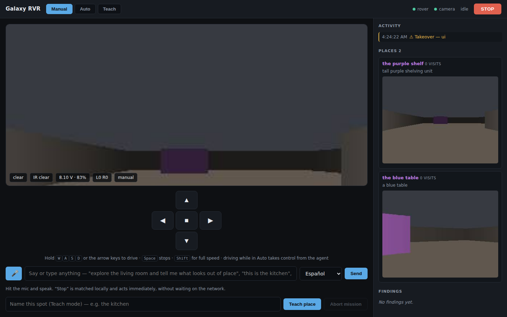

# Galaxy RVR × Claude

Voice control, autonomous missions, manual takeover and a semantic map you build
by driving the rover around and telling it where it is — one system, three modes,
for a stock [SunFounder Galaxy RVR](https://docs.sunfounder.com/projects/galaxy-rvr/en/latest/).

**No firmware changes.** The ESP32-CAM already exposes everything needed: an
MJPEG stream and a WebSocket that passes binary frames straight through to the
Arduino. This code speaks that protocol, so it is a drop-in replacement for the
SunFounder Controller app rather than a fork of the robot.



---

## The idea

Claude with vision takes 1–3 seconds per round trip. That is useless for *not
hitting the wall* and excellent for *deciding where to go*. So control is split,
and the split is the whole design:

| Layer | Runs on | Rate | Owns |
|---|---|---|---|
| Reflex | this host, `rover.py` | 10 Hz | not colliding, not running the battery flat |
| Deliberation | Claude, `agent.py` | ~0.3–1 Hz | where to go and why |

Claude never sends motor timings it expects to be repeatable. It issues
intentions — *turn until the doorway is centred* — and a reflex loop underneath
clamps every one of them against live sensors and refuses the dangerous ones.

This is also how real rovers work. Curiosity gets a plan per sol and executes it
with local autonomy. The latency is not something the design works around; it is
what the design is for.

## The three modes are one system

```
                    ┌──────── SAFETY ────────┐   always wins, cannot be overridden
                    │   ultrasonic + IR      │
                    │   battery floor        │
                    │   command watchdog     │
                    └───────────┬────────────┘
                                │
        MANUAL ─────────────────┤ preempts       AUTO ── Claude tool loop
        keyboard / D-pad        │                       drive, look, scan,
        voice "go forward"      │                       goto_place, report…
                                │
        TEACH ──────────────────┘
        drive + name places, moves recorded as approach hints
```

**Takeover is the point.** Drive while a mission is running and you simply have
the rover — no pause button, no confirmation. The agent's in-flight tool call is
cancelled, answered with an explicit `INTERRUPTED` result so its message history
stays valid, and the agent is parked. Hand control back and it is told it was
moved and shown where it is now, so it re-orients instead of continuing from a
stale belief about its own position.

## Quick start

Nothing below needs a robot. Start with the simulator.

```bash
pip install -r requirements.txt
export ANTHROPIC_API_KEY=sk-ant-...      # optional: manual driving works without it
python -m rvr --mock
# open http://127.0.0.1:8080
```

The mock renders a small navigable world through a raycaster, drifts its heading
the way a chassis with no encoders actually drifts, and speaks the real wire
protocol. Everything above the transport layer runs against it.

Then, on real hardware:

```bash
cp config.example.yaml config.yaml    # set rover_host
python -m rvr
```

### Driving

- **Hold** `W`/`A`/`S`/`D` or the arrow keys. `Shift` for full speed, `Space` to stop.
- Commands are re-sent at 10 Hz and expire on their own, so a dropped keyup, a
  closed lid or a crashed brain all coast to a stop rather than driving on.

### Talking to it

Press the mic (Chrome/Edge — `SpeechRecognition` is not in Safari yet) or type.
Everything goes to the same place:

| You say | What happens |
|---|---|
| *"pará"* / *"stop"* | Matched **locally**, executed before any network call |
| *"andá para adelante un poco"* | One bounded manual movement |
| *"esto es la cocina"* | Teaches the current spot — Claude writes the description from what it sees |
| *"andá a la cocina"* | Autonomous visual navigation to a taught place |
| *"explorá el living y contame qué hay fuera de lugar"* | A full mission |

Replies come back as speech in your language.

### Teaching places

Switch to **Teach**, drive somewhere, type a name and hit *Teach place*. The
rover scans, and Claude writes a description of what is durably visible there —
fixed landmarks and layout, not movable clutter — so it can recognise the spot
later. Teaching the same name twice adds views rather than replacing them.

Places are stored as keyframes plus prose, never coordinates. See the limits
below for why.

---

## What was verified, and how

The protocol was read out of the firmware, not the docs, and the docs are wrong
in at least one place that matters:

| | |
|---|---|
| WebSocket | **port 30102** — `galaxy-rvr.h` sets `#define PORT "30102"`; the comment beside it, and the docs, say 8765 |
| Camera | port 9000, `/mjpg` and `/capture` |
| Framing | `0xA0 │ len │ xor │ payload │ 0xA1`, both directions |
| Commands | `0x01` motors (int8 ±100) · `0x02` RGB · `0x03` tilt (0–140) · `0x04` lamp · `0x05` obstacle mode |
| Telemetry | `0x81` ultrasonic (uint16 BE, tenths of mm) · `0x82` IR bitfield `(left<<1)\|right` · `0x83` battery (`raw/100 + 6` volts) |
| Keep-alive | text `ping` every second; the ESP32 drops a client silent for 3s |

Two details that cost real debugging time if you meet them cold:

- **The checksum is asymmetric.** The Arduino's *parser* validates `XOR(payload)`,
  while its *emitter* computes `XOR(0xA0, len, 0x00, payload…)`. So outbound
  frames must use the first convention, and inbound telemetry must tolerate the
  second. `decode_frame` accepts both.
- **Out-of-range ultrasonic reads as 65526.** The firmware returns `-1.0` and
  stuffs `-10` into a `uint16`. Read naively that is 6553 cm of open road,
  straight into whatever is actually there.

Both are pinned by tests that build frames with a line-by-line transcription of
the firmware's own emitter (`tests/test_protocol.py`).

```bash
pytest                 # 66 tests, no hardware and no network required
```

---

## The wifi problem — read this before buying batteries

In its default **AP mode** the rover serves its own network (`GalaxyRVR` /
`12345678`). Join it and your machine has **no internet**, so the Anthropic API
is unreachable and autonomy cannot work at all.

Fix it before writing any mission logic. In order of preference:

1. **Put the ESP32 in station mode** so it joins your home wifi. The
   `ai-camera-firmware` settings page supports this; it reports the resulting
   address as `StaIp` in the WebSocket handshake and prints it over serial at
   boot. Put that in `rover_host`. This is the setup you want.
2. Two interfaces on the host — ethernet for the internet, wifi for the rover.
3. Phone hotspot that both join.

## Honest limits

- **No odometry.** No encoders, no compass. "Drive 1 metre" is not a thing this
  chassis can do — the same command covers different ground on carpet than on
  tile, and less as the battery drains. Everything here navigates visually
  instead, and `goto_place` is best-effort visual search that degrades into
  "keep looking" rather than confidently driving into a wall. Recorded approach
  traces are kept as *hints about effort and direction*, never replayed as routes.
- **The reflex layer is not a guarantee.** Ultrasonic and IR are short-range and
  fooled by dark or soft surfaces. Nothing sees below bumper height, behind, or
  at table-edge height. **Do not run this near stairs.**
- **One camera, tilt only.** Looking sideways means turning the whole rover.
- **Cost grows with mission length.** Frames are ~400 tokens each; context is
  trimmed to the last 5 images, and `max_steps` bounds a run. Watch both.
- **The mock is a sandbox, not a simulator.** No wheel slip, no lighting, no real
  dynamics. It proves the software runs; it does not prove the robot behaves.
- **The control UI has no authentication.** Anyone who can reach the port can
  drive your robot. It binds to `127.0.0.1` for that reason — think before
  changing that.

## Layout

```
rvr/
  protocol.py      wire format, verified against firmware   ← start here
  transport.py     websocket + single-connection MJPEG reader
  rover.py         high-level control + the reflex layer
  arbiter.py       modes, takeover, teaching
  agent.py         Claude tool loop, interruptible mid-tool
  tools.py         the tool surface as Claude sees it
  semantic_map.py  places, keyframes, approach traces
  intent.py        voice routing (local stop words + Claude)
  mock.py          simulated rover, so all of the above is runnable
  server.py        aiohttp control app
ui/index.html      the desktop app
```

## Credit

Protocol derived by reading [`sunfounder/galaxy-rvr`](https://github.com/sunfounder/galaxy-rvr),
[`sunfounder/ai-camera-firmware`](https://github.com/sunfounder/ai-camera-firmware) and
[`sunfounder/SunFounder_AI_Camera`](https://github.com/sunfounder/SunFounder_AI_Camera).
